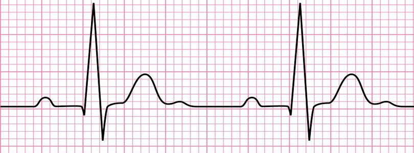
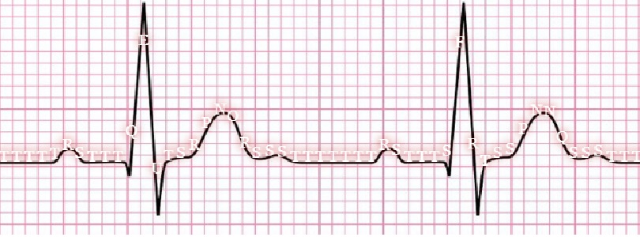

This project was bootstrapped with [Create React App](https://github.com/facebookincubator/create-react-app).

# About
"Din-don" is a free web application that provides you the actual info about your heart state based on its' ECG.
For more details, please, proceed to the [demo](https://goodwin64.github.io/din-don-heart/) page.

# Example
Having a raw ECG plot:

after analysis it looks something like:

in computer memory, which is the base for detecting heart diseases.

# Project state and TODO steps
Must-have widgets:
- [x] ECG visual analysis
- [ ] Heart diseases demo templates
- [ ] Save for offline usage
- [ ] Configuring options

Optional nice features:
- [ ] Error handling (UI part)
- [x] Animated logo
- [ ] Feedback
- [ ] User actions analytics (with GDPR)
- [ ] Localization (EN, RU)

Easy development:
- [x] Travis CI configuration
- [ ] Github templates
- [x] ESLint + prettier
